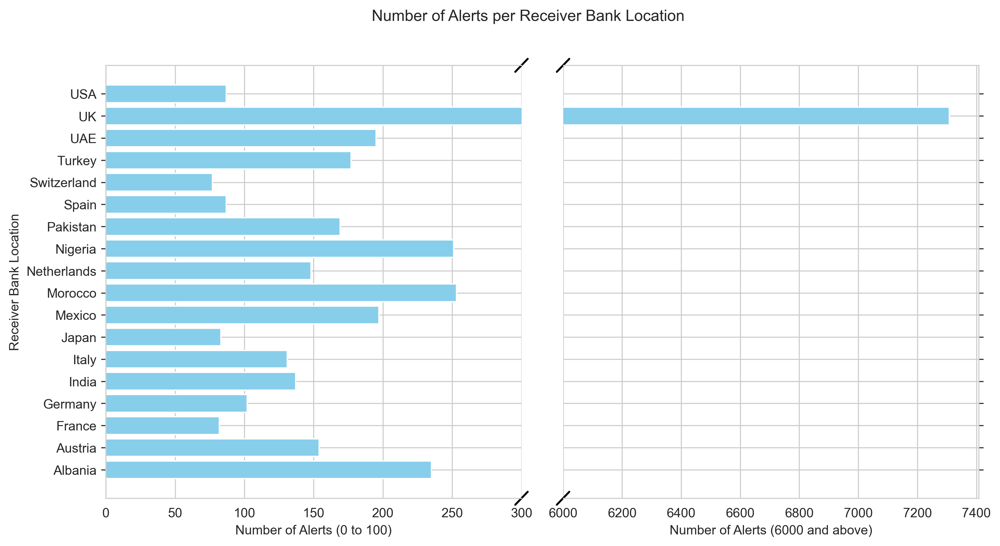
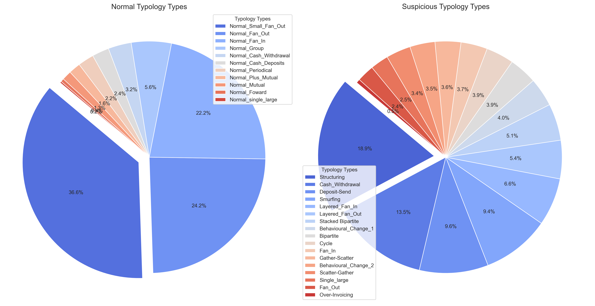
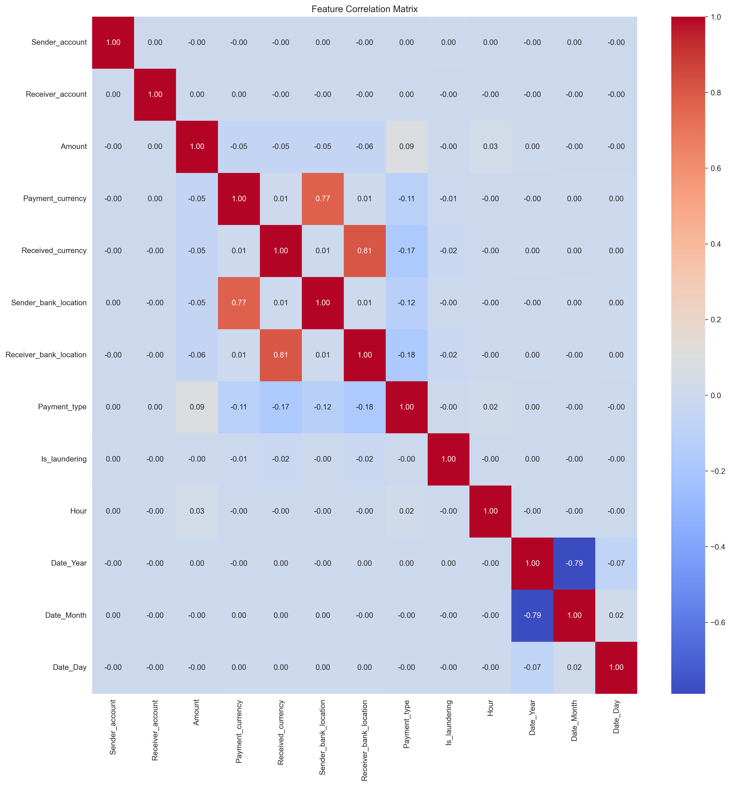
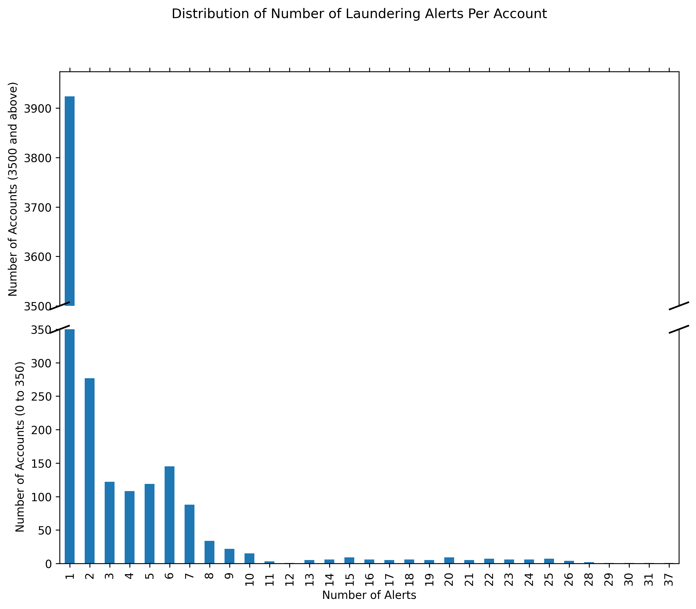
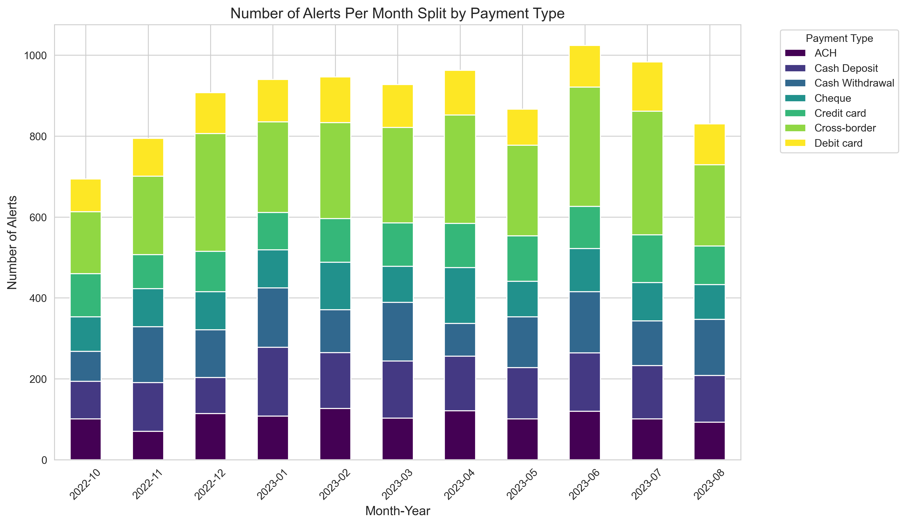

# Development of Tab-AML: A Transformer-Based Model for Transaction Monitoring in Anti-Money Laundering

This repository contains code from my PhD project: **Enhancing Transaction Monitoring Controls to Detect Money Laundering Using Machine Learning**.

## Problem Statement
Currently, many banks rely on rules-based methods for transaction monitoring, which can be highly inefficient due to the large number of false positives generated. These false positives lead to high operational costs and can strain investigative teams.

## Motivation
Machine learning models, such as XGBoost, have shown promise in detecting anomalies within transaction data. However, there is a significant lack of research exploring deep learning approaches—especially transformer-based models—for anti-money laundering (AML) transaction monitoring.

## Solution: Tab-AML
In this project, we aim to address these limitations by leveraging deep learning to improve transaction monitoring in the fight against money laundering. The development process of **Tab-AML** includes:

1. **Exploratory Data Analysis (EDA)**: Conducting a thorough EDA to better understand the data and prepare it for model training.
2. **Baseline Model Evaluation**: Experimenting with traditional machine learning models to establish baseline performance.
3. **Deep Learning Exploration**: Developing and experimenting with transformer-based models to determine their effectiveness compared to baseline methods.
4. **Development of Tab-AML**: Designing and training **Tab-AML**, a transformer-based model specifically for transaction monitoring in AML.

### Dataset
The dataset used in this project is a synthetic transaction monitoring dataset that I created during my PhD, which is publicly available on Kaggle. You can find the dataset here: [Synthetic Transaction Monitoring Dataset - AML](https://www.kaggle.com/datasets/berkanoztas/synthetic-transaction-monitoring-dataset-aml)

### Baseline Models
- **XGBoost**
- **Logistic Regression**
- **Random Forest**
- **Decision Trees**
- **K-Nearest Neighbors (KNN)**
- **Naive Bayes**

### Deep Learning Models
- **TabTransformer**
- **TabNet**
- **Tab-AML** (our enhanced transformer-based solution)

### Key Findings
In our experiments, the transformer-based models demonstrated superior performance in transaction monitoring. **Tab-AML** achieved an ROC-AUC score of **93.01%**, while **TabTransformer** achieved **85.94%**, both surpassing **XGBoost**’s score of **81.12%**, which has traditionally been considered highly effective for classification tasks in tabular data, including anti-money laundering applications.

The experiments showed that transformer models, particularly **Tab-AML**, excel in handling **interlinked transactions**, largely due to the effectiveness of residual attention and shared embedding mechanisms. These features enhanced the model's ability to capture intricate dependencies between transactions, resulting in improved performance on this specific type of data.

Here are some visual results from our experiments:

### Model Performance
Validation and test AUC scores for different models after hyperparameter tuning:

AUC curve and confusion matrix for the top two models:

### Exploratory Data Analysis (EDA) Diagrams
The following visualizations are some that were created during the EDA phase to gain insights into the dataset:

- **Alerts by Location**:

  

- **Laundering Typology Distribution**:

  

- **Feature Correlation Matrix**:

  

- **Laundering Alert Distribution**:

  

- **Monthly Alerts by Payment Type**:

  

## Repository Structure
- **data/**: Raw and processed datasets for model training and evaluation.
- **models/**: Saved machine learning and deep learning models.
- **src/**: Code for data processing, model training, evaluation, and utilities.
- **Report/**: Project report files, diagrams, and findings.
- **requirements.txt**: Required Python packages.
- **README.md**: Project documentation.

